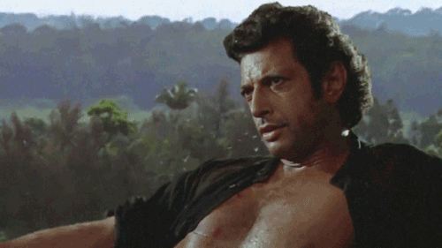
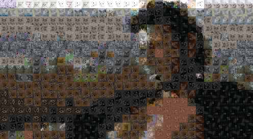

# patchies



Replace patches of images with other images.

-   breaks up an image into patches
-   for each patch:
    -   look up the approximate nearest neighbour in a dataset of other images
    -   replace the patch with the neighbour image

Uses [nmslib](https://github.com/nmslib/nmslib) for a fast nearest neighbour
lookup.


## Installation

All of the following assume a working Python 3 installation -- it's tested
against Python 3.6 currently.

### pypi

```
pip install patchies
```
_Should_ do the trick. If it doesn't, please raise an issue here.

### From Source

Clone the repo:
```
> git clone https://github.com/pfcm/patchies
```
From the root of the repo, just run the setup script.
```
python setup.py install
```
Or for development:
```
python setup.py develop
```


## Usage

```
> patches --help
Usage: patchies [OPTIONS] COMMAND [ARGS]...

  Run on some things.

Options:
  --imdir TEXT                    directory to store images
  --cores INTEGER                 number of threads to use
  --dataset [cifar100|imagenet|celeba|cats]
                                  dataset to use
  --cats_path TEXT                path to downloaded cats data
  --patch_size INTEGER            size of patches to replace
  --help                          Show this message and exit.

Commands:
  offline  Run the thing on a single image
  online   Run the thing on a video.
```
There are two commands `online` and `offline`. They share a bunch of arguments
as above, most notably `dataset` which tells it what data to expect. For
all the datasets except `cats` they will be downloaded. The cats dataset comes
from Kaggle so you will have to create an account and download it, supplying
the path with `cats_path`.

`patch_size` defines the size of the patches that will be replaced. At this
stage only `cats` supports anything apart from 32.

`imdir` controls where the downloaded datasets are stored, it's usually fine to
leave it at the default. `cores` controls roughly the parallelism of the
nearest neighbour index construction and search. Again the default value should
be fine.

### online

```
> patchies online --help
Usage: patchies online [OPTIONS]

 Run the thing on a video.

Options:
 --device TEXT  video device to use
 --help         Show this message and exit.
```

`online` is designed to run
once on a stream of video and pops up a window which compares the original
frames with the transformed ones. The amount of work to do is proportional
to the resolution of the video, so framerates for big videos are unlikely to
be particularly good.


To run in as close to real time as possible on a video:
```
> patchies [OPTIONS] online --device /path/to/video
```

OpenCV is used to open the videos, so any file format supported there is supported
here. It can also be run on an attached webcam -- the easiest way to do this
is to give it an integer (probably 0, also the default).

```
> patchies [OPTIONS] online --device 0
```

### offline

```
> patchies offline --help
Usage: patchies offline [OPTIONS] FILENAME

 Run the thing on a single image

Options:
 --outfile TEXT  output path to write
 --help          Show this message and exit.
 ```

 Runs on a single image. In the future will probably run on image sequences
 such as gifs, but currently this is not supported. `outfile` controls where
 to write the output and the input is specified as a positional argument at
 the end:

```
> patches --dataset celeba offline --outfile out.png /path/to/img.png
```
will replace all 32x32 patches of `img.png` (except for a potentially a few
pixels around the edges which will be thrown away so it all fits) with faces
of celebrities from the CelebA dataset.
